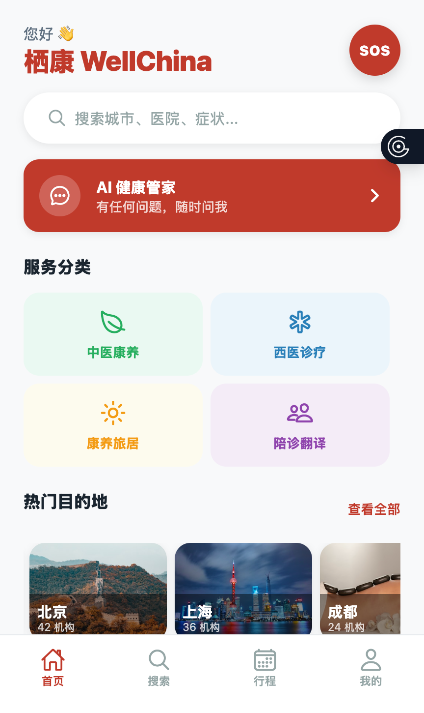
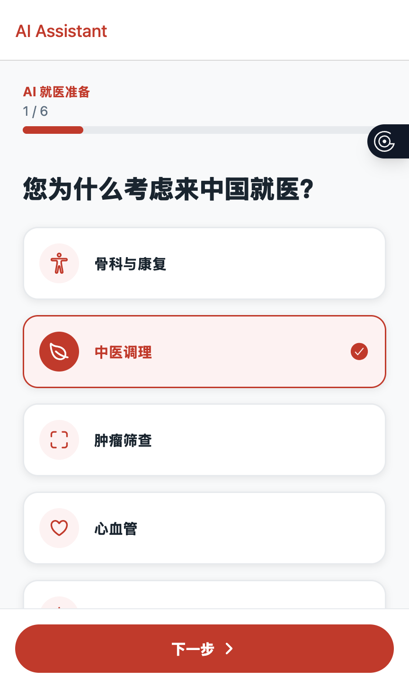
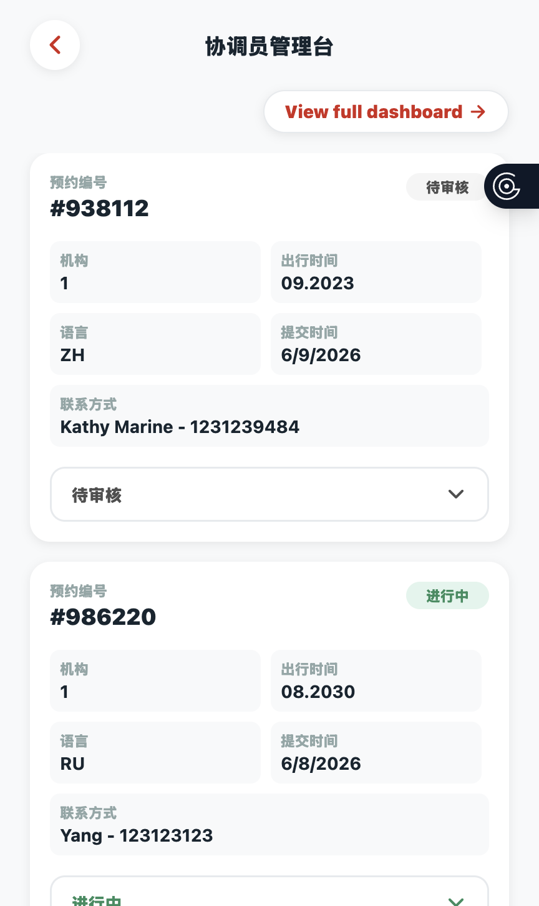
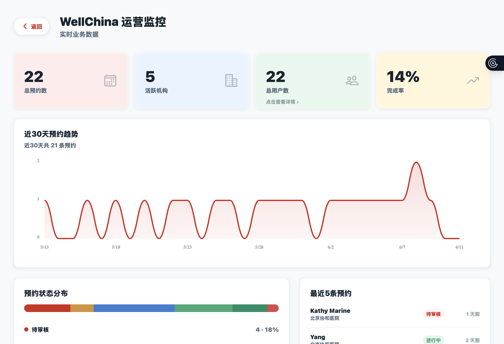
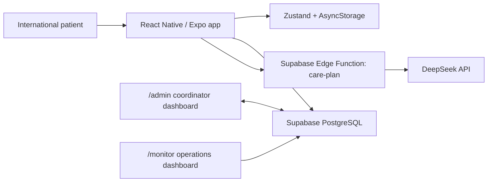

# WellChina 栖康

AI-powered healthcare companion for international patients seeking medical care in China


WellChina helps older international patients prepare for, book, and understand medical care in China without feeling lost in an unfamiliar system. The MVP focuses on one guided journey: language selection, institution discovery, AI care preparation, booking request, trip tracking, and post-visit summaries.

## Demo

📹 Demo Video: [coming soon]

🌐 Live Demo: [coming soon]

## The Problem

Foreign patients, especially elderly patients, face huge friction when seeking care in China. Language barriers, unfamiliar hospital workflows, fragmented travel logistics, and a lack of trusted guidance can make the process feel risky before care even begins. Most existing platforms focus on transactional bookings, while patients need support across the full journey: preparation, coordination, visit comprehension, and family communication. The north-star persona is Anna Volkova, a 72-year-old Russian retired doctor seeking knee rehabilitation in Sanya who needs Russian-language guidance, clear next steps, and confidence that she will not be navigating the system alone.

## The Solution

- AI-powered care preparation workflow that uses a structured 6-step form instead of open-ended free chat.
- Bilingual visit summaries for the patient, Chinese hospital/coordinator, and family members.
- Multi-language support across English, Chinese, and Russian, with accessibility features for elderly users.
- Coordinator backend for managing real booking requests, status changes, and operational follow-up.

## Key Features

| Feature | Description |
|---|---|
| Multi-language onboarding | First-run onboarding and app copy for `en`, `zh`, and `ru`. |
| AI Care Preparation | 6-step structured workflow backed by a DeepSeek LLM through a Supabase Edge Function, with local fallback generation for demo mode. |
| Booking workflow | Care request submission with status tracking from `pending_review` through coordinator review and completion states. |
| Visit Summary generator | Post-visit summary with 3 audience tabs for patient, hospital/coordinator, and family. |
| Coordinator admin dashboard | `/admin` surface for reviewing and updating booking requests. |
| Operations monitoring dashboard | `/monitor` surface for client-side operational metrics and booking monitoring from Supabase. |
| Accessibility | Large font controls and Simple Mode for older users. |
| Real-time bi-directional sync via Supabase | Local Zustand workflow state plus Supabase-backed remote booking data for bi-directional coordination. |

## Tech Stack

| Layer | Tools |
|---|---|
| Frontend | React Native, Expo, Expo Router, TypeScript, Zustand, i18next |
| Backend | Supabase PostgreSQL, Supabase Edge Functions |
| AI | DeepSeek API via Supabase Edge Function |
| State | Zustand with AsyncStorage persistence |
| Deployment | TBD |

## Screenshots







## Architecture

The user interacts with the React Native frontend, which keeps the active journey in a local Zustand store and syncs booking data to Supabase when remote configuration is available. AI care preparation calls flow from the frontend to a Supabase Edge Function, which calls the DeepSeek API and returns structured JSON that the app can render and attach to booking requests. The coordinator dashboard reads and writes the same Supabase booking tables, while the monitoring dashboard aggregates operational data client-side from Supabase.



## Project Structure

```text
.
├── apps/
│   └── mobile/
│       ├── app/                  # Expo Router screens and route groups
│       │   ├── (tabs)/           # Home, Search, Trip, Profile tabs
│       │   ├── admin.tsx         # Coordinator dashboard
│       │   ├── monitor.tsx       # Operations monitoring dashboard
│       │   ├── chat.tsx          # AI care preparation workflow
│       │   ├── care-result.tsx   # Structured care plan output
│       │   ├── booking/          # Booking request flow
│       │   └── visit-summary.tsx # Post-visit summary flow
│       ├── components/           # Shared UI and domain components
│       ├── constants/            # Theme and typography constants
│       ├── data/                 # Mock institutions and demo data
│       ├── hooks/                # Shared React hooks
│       ├── i18n/                 # en / zh / ru translations
│       ├── lib/                  # Supabase, AI, and summary helpers
│       ├── store/                # Zustand app store
│       └── types/                # Core workflow TypeScript types
├── docs/
│   └── WellChina-PRD-v0.1.md     # Product requirements and personas
├── supabase/
│   ├── functions/care-plan/      # DeepSeek-backed care plan Edge Function
│   └── migrations/               # Database schema migrations
├── ARCHITECTURE.md
├── DEMO_SCRIPT.md
├── MVP_SCOPE_v1.md
└── package.json
```

## Getting Started

Use Node.js `>=20 <23`. The root package declares `pnpm@9.0.0`.

```bash
pnpm install
pnpm --dir apps/mobile install
pnpm web
```

For a clean Expo web launch:

```bash
pnpm web:clear
```

You can also run the mobile app directly:

```bash
cd apps/mobile
npx expo start --web --clear
```

Do not run `npx expo start --web` from the repository root. The root is the monorepo workspace; the Expo Router app entry lives in `apps/mobile/app`.

## Environment

The mobile app reads Supabase configuration from Expo public environment variables:

```bash
EXPO_PUBLIC_SUPABASE_URL=...
EXPO_PUBLIC_SUPABASE_ANON_KEY=...
```

The AI Edge Function reads DeepSeek secrets from Supabase:

```bash
DEEPSEEK_API_KEY=...
DEEPSEEK_MODEL=deepseek-chat
```

If Supabase is not configured, the app falls back to local demo behavior for the core care-preparation flow.

## Available Scripts

| Command | Purpose |
|---|---|
| `pnpm web` | Start the Expo web app from `apps/mobile`. |
| `pnpm web:clear` | Start Expo web with cache clearing. |
| `pnpm dev:mobile` | Start the Expo development server. |
| `pnpm typecheck` | Run Turbo typecheck tasks. |
| `pnpm --dir apps/mobile typecheck` | Typecheck the mobile app directly. |
| `pnpm lint` | Run Turbo lint tasks. |
| `pnpm test` | Run Turbo test tasks. |

## Core User Flow

```text
Language selection
  -> Home / Search
  -> Institution detail
  -> AI care preparation
  -> Booking request
  -> Trip status
  -> Visit summary
```

## Product Docs

- [Architecture](ARCHITECTURE.md)
- [Demo Script](DEMO_SCRIPT.md)
- [MVP Scope](MVP_SCOPE_v1.md)
- [PRD v0.1](docs/WellChina-PRD-v0.1.md)
- [Known Issues](apps/mobile/KNOWN_ISSUES.md)

## Current Limitations

- The MVP does not provide medical diagnosis, prescriptions, emergency triage, insurance processing, or hospital HIS/EMR integration.
- Booking is modeled as a care request, not a paid order; payments and refunds are intentionally out of scope for the MVP.
- Visit summaries and translations are still demo-oriented in parts and should be connected to production translation/summary services before real clinical use.
- Deployment target and production release process are still TBD.

## Safety Note

WellChina is designed to support healthcare preparation, coordination, and communication. It is not a medical device and should not be used as a substitute for professional medical advice, diagnosis, treatment, or emergency care.
